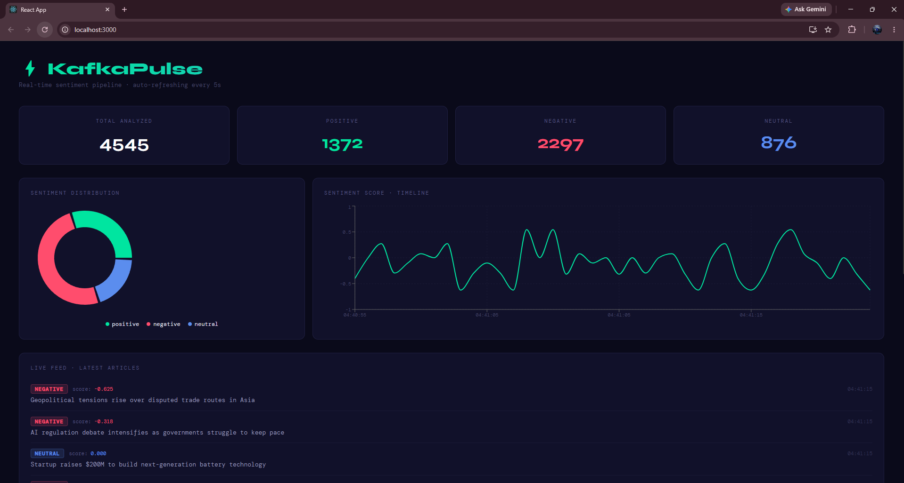

# ⚡ KafkaPulse

A real-time sentiment analysis pipeline that ingests streaming news data, processes it with NLP, and displays live insights on a dashboard.



## Tech Stack

- **Apache Kafka** — real-time message streaming
- **Python** — producer and consumer services
- **VADER NLP** — sentiment analysis
- **MongoDB** — persistent storage
- **FastAPI** — REST API backend
- **React + Recharts** — live dashboard

## Architecture

```
News API
   ↓
Producer (Python)
   ↓
Apache Kafka  →  raw_text topic
   ↓
Consumer (Python + VADER)
   ↓
MongoDB
   ↓
FastAPI
   ↓
React Dashboard (localhost:3000)
```

## Project Structure

```
KafkaPulse/
├── producer/
│   ├── news_producer.py       # Fetches data, publishes to Kafka
│   └── docker-compose.yml     # Kafka + MongoDB via Docker
├── consumer/
│   ├── sentiment_consumer.py  # Reads Kafka, runs VADER, saves to MongoDB
│   └── .env                   # MongoDB URI (not committed)
├── api/
│   ├── main.py                # FastAPI endpoints
│   └── .env                   # MongoDB URI (not committed)
├── frontend/
│   └── src/
│       └── App.js             # React dashboard
├── start.ps1                  # Start everything with one command
├── stop.ps1                   # Stop everything with one command
└── README.md
```

## Getting Started

### Prerequisites

- Python 3.9+
- Docker Desktop
- Node.js (LTS)

### Installation

```bash
# Clone the repo
git clone https://github.com/yourusername/kafkapulse.git
cd kafkapulse

# Create virtual environment
python -m venv .venv
.venv\Scripts\activate

# Install Python dependencies
pip install kafka-python requests vaderSentiment pymongo python-dotenv fastapi uvicorn

# Install React dependencies
cd frontend
npm install
cd ..
```

### Configuration

Create a `.env` file inside both `consumer/` and `api/` folders:

```
MONGO_URI=mongodb://localhost:27017
```

### Run

```powershell
Set-ExecutionPolicy -Scope Process -ExecutionPolicy Bypass
.\start.ps1
```

This starts all 5 services automatically:
- Kafka + MongoDB (Docker)
- Producer
- Consumer
- FastAPI on http://localhost:8000
- React dashboard on http://localhost:3000

### Stop

```powershell
.\stop.ps1
```

## API Endpoints

| Endpoint | Description |
|---|---|
| `GET /api/stats` | Sentiment counts (positive/negative/neutral) |
| `GET /api/recent` | Latest analyzed articles |
| `GET /api/timeline` | Sentiment scores over time |

## Features

- Real-time data ingestion via Kafka
- VADER sentiment scoring on every article
- Live dashboard with auto-refresh every 5 seconds
- Sentiment distribution donut chart
- Score timeline chart
- Live article feed with sentiment labels
- Single command startup and shutdown
